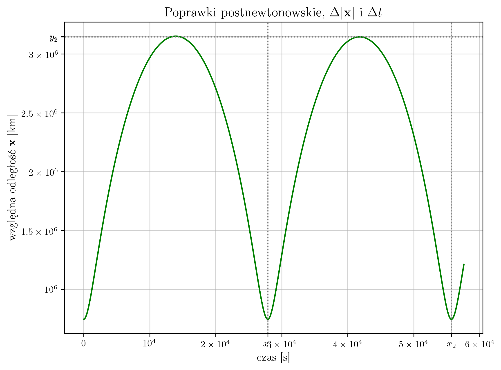

<p align="center">
  
  <br>
  <em>Na grafice przedstawiono odległość składowych badanego układu w funkcji czasu. Wpływ poprawek postnewtonowskich przeskalowano przez czynnik 10<sup>10</sup></em>
</p>

Repozytorium projektowe Zespołowego Projektu Studenckiego wykonanego w semestrze letnim 2026 pod opieką dr Tomasza Tarkowskiego na Wydziale Fizyki UW. 

Ilościowym badaniom poddano zanik półosi wielkiej oraz okresu orbitalnego pulsara Hulse'go-Taylora w reżimie postnewtonowskim. Zagadnienie rozpatrzono dwiema metodami: wyzyskując algorytm Runge-Kutty oraz Dormanda-Prince'a.

### Algorytm Runge-Kutty

Kod napisany w C++ należy skompilować załączając trzy biblioteki własne. Przykładowe polecenie — zakładające strukturę folderu projektowego zgodną z tą w repozytorium — zamieszczono poniżej:

```bash
g++ main.cpp lib/vectors.cpp lib/writers.cpp lib/kutta.cpp -Ilib -o main
